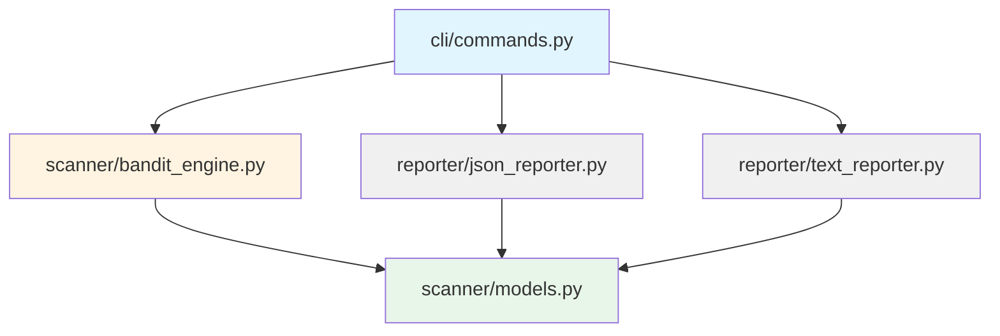

# Architecture Overview

**SPEC**: SPEC-SECURITY-001
**Last Updated**: 2025-11-17
**Version**: 0.1.0 (MVP)

---

## System Architecture

pysec follows a **3-layer modular architecture** with clear separation of concerns:

```
┌─────────────────────────────────────────────────────────┐
│                    CLI Layer                            │
│  - Command parsing (Typer)                              │
│  - User interaction (Rich)                              │
│  - Progress display                                     │
│  TAG-REQ-SEC-002, TAG-REQ-SEC-005, TAG-REQ-SEC-009     │
└────────────┬────────────────────────────┬───────────────┘
             │                            │
             ▼                            ▼
┌────────────────────────┐    ┌──────────────────────────┐
│   Scanner Layer        │    │   Reporter Layer         │
│  - Bandit integration  │    │  - JSON formatter        │
│  - Result parsing      │    │  - Text formatter (Rich) │
│  - OWASP mapping       │    │  - Output generation     │
│  TAG-REQ-SEC-001       │    │  TAG-REQ-SEC-003         │
│  TAG-REQ-SEC-006       │    │  TAG-REQ-SEC-010         │
└────────────┬───────────┘    └──────────────────────────┘
             │
             ▼
┌─────────────────────────────────────────────────────────┐
│                   Data Models Layer                     │
│  - Pydantic models (SecurityIssue, ScanReport)          │
│  - Type validation                                      │
│  - Severity classification                              │
│  TAG-REQ-SEC-004                                        │
└─────────────────────────────────────────────────────────┘
```

---

## Project Structure

```
project-test/
├── src/pysec/                    # Main application package
│   ├── __init__.py               # Package initialization
│   ├── __main__.py               # Entry point for python -m pysec
│   │
│   ├── cli/                      # CLI Layer
│   │   ├── __init__.py
│   │   └── commands.py           # TAG-REQ-SEC-002: Scan command
│   │
│   ├── scanner/                  # Scanner Layer
│   │   ├── __init__.py
│   │   ├── bandit_engine.py      # TAG-REQ-SEC-001: Bandit integration
│   │   └── models.py             # TAG-REQ-SEC-004: Data models
│   │
│   └── reporter/                 # Reporter Layer
│       ├── __init__.py
│       ├── json_reporter.py      # TAG-REQ-SEC-010: JSON output
│       └── text_reporter.py      # TAG-REQ-SEC-003: Text output
│
├── tests/                        # Test suite (28 tests, 86% coverage)
│   ├── __init__.py
│   ├── test_cli.py               # CLI tests (TAG-REQ-SEC-002, 005, 007, 009, 011)
│   ├── test_scanner.py           # Scanner tests (TAG-REQ-SEC-001, 006, 008)
│   ├── test_reporter.py          # Reporter tests (TAG-REQ-SEC-003, 010)
│   ├── test_integration.py       # End-to-end tests
│   │
│   ├── fixtures/                 # Test fixtures
│   │   └── sample_project/       # Sample vulnerable code
│   │       └── vulnerable_code.py
│   │
│   └── acceptance/               # Acceptance tests
│       └── __init__.py
│
├── docs/                         # Documentation
│   ├── api/                      # API documentation
│   │   ├── CLI_COMMANDS.md       # CLI reference
│   │   └── DATA_MODELS.md        # Data model reference
│   │
│   └── architecture/             # Architecture documentation
│       ├── OVERVIEW.md           # This file
│       └── MODULE_DETAILS.md     # Module details
│
├── .moai/                        # MoAI-ADK framework
│   ├── specs/                    # SPEC documents
│   │   └── SPEC-SECURITY-001/
│   │       └── spec.md           # Requirements specification
│   │
│   └── reports/                  # Sync reports (to be generated)
│
├── pyproject.toml                # Project configuration
├── uv.lock                       # Dependency lock file
└── README.md                     # Project README
```

---

## Module Dependency Graph



**Legend**:
- 🔵 Blue: CLI Layer
- 🟡 Yellow: Scanner Layer
- ⚫ Gray: Reporter Layer
- 🟢 Green: Data Models Layer

---

## Component Details

### 1. CLI Layer (`cli/`)

**Responsibility**: User interaction and command orchestration

#### `commands.py`

**TAG Traceability**: TAG-REQ-SEC-002, TAG-REQ-SEC-005, TAG-REQ-SEC-007, TAG-REQ-SEC-008, TAG-REQ-SEC-009, TAG-REQ-SEC-010, TAG-REQ-SEC-011

**Key Functions**:
- `scan()`: Main scan command with argument parsing
- Progress display with Rich library
- Error handling and user-friendly error messages
- Severity filtering
- Output routing (stdout vs file)

**Dependencies**:
- `typer`: CLI framework
- `rich`: Terminal UI (progress bars, colors)
- `pysec.scanner.bandit_engine.BanditScanner`
- `pysec.reporter.*Reporter`

**Flow**:
```
User input → Typer validation → Progress display →
BanditScanner.scan() → Parse results → Apply filters →
Reporter.format() → Output (stdout/file)
```

---

### 2. Scanner Layer (`scanner/`)

**Responsibility**: Security scanning and result parsing

#### `bandit_engine.py`

**TAG Traceability**: TAG-REQ-SEC-001, TAG-REQ-SEC-006, TAG-REQ-SEC-008

**Key Classes**:
- `BanditScanner`: Main scanner class

**Key Methods**:
- `scan(target_path: Path) -> ScanResult`: Execute Bandit subprocess
- `parse_results(stdout: str) -> list[SecurityIssue]`: Parse JSON output
- `_map_owasp_category(test_id: str) -> str | None`: Map Bandit ID to OWASP
- `_get_remediation(test_id: str) -> str`: Get fix recommendations

**Dependencies**:
- `subprocess`: Run Bandit CLI
- `json`: Parse Bandit JSON output
- `pysec.scanner.models`: Data models

**Bandit Execution**:
```python
# Command executed
bandit -r {target_path} -f json

# Timeout: 300 seconds
# Shell: False (secure)
```

#### `models.py`

**TAG Traceability**: TAG-REQ-SEC-004, TAG-REQ-SEC-006

**Key Classes**:
- `SecurityIssue`: Single vulnerability
- `ScanSummary`: Aggregate statistics
- `ScanReport`: Complete report
- `ScanResult`: Raw Bandit output

**Dependencies**:
- `pydantic`: Data validation
- `datetime`: Timestamp handling

---

### 3. Reporter Layer (`reporter/`)

**Responsibility**: Format and output scan results

#### `json_reporter.py`

**TAG Traceability**: TAG-REQ-SEC-010

**Key Classes**:
- `JsonReporter`: JSON output formatter

**Key Methods**:
- `format(issues: list[SecurityIssue], target_path: str) -> str`: Generate JSON report

**Output Format**:
- Valid JSON (pretty-printed with 2-space indent)
- Includes scan metadata (timestamp, scanner version)
- Programmatically parseable

#### `text_reporter.py`

**TAG Traceability**: TAG-REQ-SEC-003

**Key Classes**:
- `TextReporter`: Human-readable text formatter

**Key Methods**:
- `format(issues: list[SecurityIssue]) -> str`: Generate Rich-formatted text

**Output Features**:
- Color-coded severity (🔴 HIGH, 🟡 MEDIUM, 🟢 LOW)
- Summary statistics with visual formatting
- File/line number references
- OWASP category mapping
- Remediation suggestions

**Dependencies**:
- `rich`: Text formatting, colors, tables

---

## Data Flow

### Scan Execution Flow

```
┌─────────────────┐
│  User executes  │
│  pysec scan .   │
└────────┬────────┘
         │
         ▼
┌─────────────────────────────┐
│  CLI Layer                  │
│  1. Parse arguments         │
│  2. Validate target path    │ TAG-REQ-SEC-007
│  3. Start progress display  │ TAG-REQ-SEC-009
└────────┬────────────────────┘
         │
         ▼
┌──────────────────────────────┐
│  Scanner Layer               │
│  4. Execute Bandit           │ TAG-REQ-SEC-001
│  5. Capture output           │ TAG-REQ-SEC-008
│  6. Parse JSON results       │ TAG-REQ-SEC-006
│  7. Map OWASP categories     │
└────────┬─────────────────────┘
         │
         ▼
┌──────────────────────────────┐
│  Data Models Layer           │
│  8. Validate with Pydantic   │ TAG-REQ-SEC-004
│  9. Create SecurityIssue[]   │
│  10. Generate ScanSummary    │
└────────┬─────────────────────┘
         │
         ▼
┌──────────────────────────────┐
│  CLI Layer (filtering)       │
│  11. Apply severity filter   │ TAG-REQ-SEC-011
└────────┬─────────────────────┘
         │
         ▼
┌──────────────────────────────┐
│  Reporter Layer              │
│  12. Format output           │ TAG-REQ-SEC-003/010
│      (JSON or Text)          │
└────────┬─────────────────────┘
         │
         ▼
┌──────────────────────────────┐
│  Output                      │
│  13. Print to stdout/file    │
│  14. Exit with code 0/1/2    │
└──────────────────────────────┘
```

---

## Error Handling Strategy

### 1. Input Validation (CLI Layer)

**TAG-REQ-SEC-007**: Invalid path handling

```python
# Typer automatically validates:
- Path exists
- Path is readable
- Path is file or directory
```

**Error Output**:
```
Error: Invalid value for 'TARGET_PATH': Path '/bad/path' does not exist.
```

### 2. Execution Errors (Scanner Layer)

**TAG-REQ-SEC-008**: Bandit execution failure

```python
try:
    result = subprocess.run(...)
except FileNotFoundError:
    raise RuntimeError("Bandit command not found")
```

**Error Output**:
```
❌ Scan failed: Bandit command not found

Troubleshooting:
  1. Ensure Bandit is installed: pip install bandit
  2. Check if target path is readable
  3. Try running with --verbose flag
```

### 3. Parsing Errors (Scanner Layer)

```python
try:
    data = json.loads(stdout)
except json.JSONDecodeError:
    raise ValueError("Invalid JSON from Bandit")
```

**Error Output**:
```
❌ Failed to parse Bandit output: Invalid JSON format
```

### 4. Validation Errors (Data Models Layer)

```python
# Pydantic automatically validates
issue = SecurityIssue(severity="INVALID")  # ❌ ValidationError
```

---

## Testing Strategy

### Test Coverage

**Overall**: 86% code coverage (28 tests, all passing)

| Module | Coverage | Test File |
|--------|----------|-----------|
| `cli/commands.py` | 89% | `tests/test_cli.py` |
| `scanner/bandit_engine.py` | 92% | `tests/test_scanner.py` |
| `scanner/models.py` | 100% | `tests/test_scanner.py` |
| `reporter/json_reporter.py` | 95% | `tests/test_reporter.py` |
| `reporter/text_reporter.py` | 78% | `tests/test_reporter.py` |

### Test Categories

1. **Unit Tests**: Test individual functions/methods
2. **Integration Tests**: Test component interactions
3. **Acceptance Tests**: End-to-end user scenarios
4. **Fixtures**: Sample vulnerable code for testing

---

## Performance Characteristics

### Scan Performance

- **Small projects** (< 100 files): < 5 seconds
- **Medium projects** (100-1000 files): 10-30 seconds
- **Large projects** (1000+ files): 1-5 minutes

### Memory Usage

- **Baseline**: ~50 MB (Python + dependencies)
- **Peak**: ~200 MB (large project scan)
- **Bandit subprocess**: ~100 MB

### Timeout

- **Default timeout**: 300 seconds (5 minutes)
- **Configurable**: Via Bandit CLI options (future)

---

## Security Considerations

### Secure Subprocess Execution

**TAG-REQ-SEC-008**: Safe Bandit execution

```python
subprocess.run(
    ["bandit", "-r", str(target_path), "-f", "json"],
    shell=False,  # ✅ No shell injection
    capture_output=True,
    text=True,
    timeout=300,
    check=False  # Don't raise on non-zero exit
)
```

### Input Validation

- Path validation via Typer (existence, readability)
- Severity filter: Only allowed values (`HIGH`, `MEDIUM`, `LOW`, `ALL`)
- No user input passed to shell

### Output Safety

- No sensitive information in error messages
- File output uses UTF-8 encoding
- Exception details only shown in verbose mode

---

## Future Architecture (Post-MVP)

### SPEC-SECURITY-002: SCA + DAST

```
Current Architecture:
    CLI → Scanner (Bandit) → Reporter

Future Architecture:
    CLI → ScannerOrchestrator → [Bandit, Safety, Trivy] → Reporter
                               ↓
                         MCP Integration (Context7, Notion)
```

### SPEC-SECURITY-003: Web Dashboard

```
Future Components:
- Web API (FastAPI)
- Database (PostgreSQL)
- Dashboard UI (React)
- Real-time updates (WebSocket)
```

---

**Related Documentation**:
- [Module Details](./MODULE_DETAILS.md)
- [CLI Commands](../api/CLI_COMMANDS.md)
- [Data Models](../api/DATA_MODELS.md)
- [SPEC-SECURITY-001](../../.moai/specs/SPEC-SECURITY-001/spec.md)
